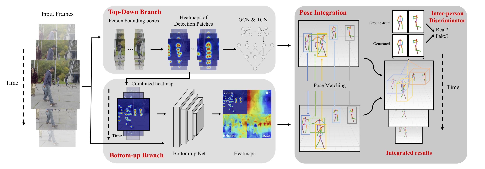

## 3D Multi-Person Pose Estimation by Integrating Top-Down and Bottom-Up Networks

[](https://arxiv.org/pdf/2104.01797v2.pdf)

## Introduction

This repository contains the code and models for the following paper.

> [Monocular 3D Multi-Person Pose Estimation by Integrating Top-Down and Bottom-Up Networks](https://arxiv.org/pdf/2104.01797v2.pdf)  
> Cheng Yu, Bo Wang, Bo Yang, Robby T. Tan  
> Computer Vision and Pattern Recognition, CVPR 2021.


Overview of the proposed method:

<p align="center"></p>

## Installation

### Dependencies
[Pytorch](https://pytorch.org/) >= 1.5<br>
Python >= 3.6<br>

Create an enviroment. 
```
conda create -n gntcn python=3.6
conda activate gntcn
```
Install the latest version of pytorch (tested on pytorch 1.5 - 1.7) based on your OS and GPU driver installed following [install pytorch](https://pytorch.org/). For example, command to use on Linux with CUDA 11.0 is like:
```
conda install pytorch torchvision cudatoolkit=11.0 -c pytorch
```

Install dependencies
```
pip install - r requirements.txt
```

Build the Fast Gaussian Map tool:

```
cd lib/fastgaus
python setup.py build_ext --inplace
cd ../..
```

## Pre-trained Models

Download the pre-trained model and processed human keypoint files [here](https://www.dropbox.com/s/n1twh0v5cyzd0z9/3DMPP.zip?dl=0), and unzip the downloaded zip file to this project's directory, two folders are expected to see after doing that (i.e., `./ckpts` and `./mupots`).

## Usage 

### Prepare the data

MuPoTS eval set is needed to perform evaluation, which is available on the [MuPoTS dataset website](http://gvv.mpi-inf.mpg.de/projects/SingleShotMultiPerson/) (download the mupots-3d-eval.zip file, unzip it, and run `get_mupots-3d.sh` to download the dataset). After the download is complete, MultiPersonTestSet.zip (5.6 GB) is avaiable. Unzip it and move the folder `MultiPersonTestSet` to the root directory of the project to perform evaluation on MuPoTS test set. Now you should see the following directory structure. 
```
${GnTCN_ROOT}
|-- ckpts
|-- lib
|-- MultiPersonTestSet
|-- mupots
|-- util
|-- calculate_mupots_depth.py
|-- other python code, LICENSE, and README files
...
```

### 3D human pose estimation evaluation on MuPoTS eval set

We split the whole pipeline into several separate steps to make it more clear for the users. 

```
python calculate_mupots_topdown_pts.py
python calculate_mupots_topdown_depth.py
python calculate_mupots_btmup.py
python calculate_mupots_integrate.py
```

To evaluate relative PCK, run:
```
python eval_mupots_pck.py
```

To evaluate absolute PCK, run:
```
python eval_mupots_pck_abs.py
```

