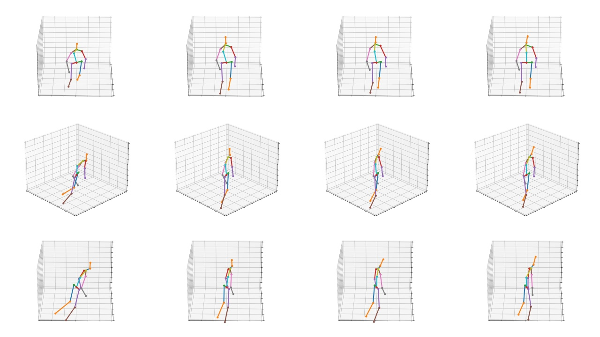

### Visualization of the dataset gap adaptation

Dataset gap adaptation results is visualized in above figure. Each row is a different angle of the estimated 3D human pose. The first column is the original predicted pose using the model trained on Human3.6M, the second column is the result after the rotation adaptation, the third column is the result of the joint adaptation based on reference [47], the last column is the ground-truth of MuPoTS.   

